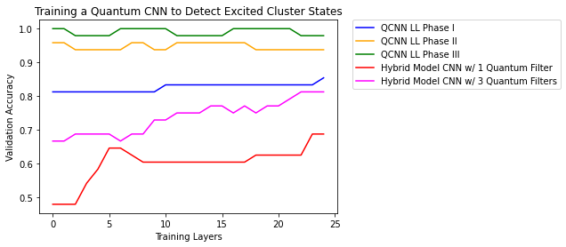

## Quantum Neural Network Error Mitigation: QCNN With Layerwise Learning
**Joe Vetere**<br />
**Morgan Beadlescomb**<br />
**Krishna Pothugunta**
</img>
### News

- **Apr 26, 2022**: Presented in ECE-884-SS22: Deep Learning @ Michigan State University

### Hypothesis
Quantum Convolutional Neural Networks built on Quantum Circuit Born Machines using Layerwise Learning techniques offer a superior approach to dealing with errors on NISQ devices than that of Quantum CNN, Hybrid CNN or Layerwise Learning approaches alone in quantum datasets.

### Abstract
Inspired by the works of Cong, Choi, & Lukin in [Quantum Convolutional Neural Networks](https://www.nature.com/articles/s41567-019-0648-8) and Andrea Skolik, Jarrod R. McClean, Masoud Mohseni, Patrick van der Smagt, Martin Leib with [Layerwise Learning for Quantum Neural Networks](https://arxiv.org/abs/2006.14904), we attempt to combine methodologies and apply strategy for classifying excitation data in a fashion that outperforms Hybrid QCNN models that have outperformed purely quantum solutions in the past. Leveraging defined intialization system states and layerwise learning upon a QCNN made up of layers of 1D convolution and pooling sequences, we examine a novel approach that does indeed outperform the quai-classical comptetition on this data set.


## Setup
This experimental proof of concept was developed entirely on Google Colab.

Notebook runtimes were configured with the following:
- GPU Hardware Accelerator
- High RAM Runtime Shape
- Background Execution Enabled

The following packages were installed:
- Python 3.7.13
- TensorFlow 2.7.0
- TensorFlow Quantum 0.6.1
- Cirq 0.13.1
- Sympy 1.8
- Numpy 1.16
- Matplotlib 3.0


## Model performance
</img>


## Findings

1.  Layerwise learning outperformed the pure QCNN as well as the classical Hybrid model.
2.  Combination of QCNN with a set of layers and partitions outperformed a pure LL scenario.
3.  The difference between the Hybrid model and the pure QCNN were marginal, but the  hybrid model is more complex to manage. 
4.  Increase in number of epochs lead to improved results, although too many epochs might lead to overfitting.


## License

```
Licensed under the Apache License, Version 2.0 (the "License");
you may not use this file except in compliance with the License.
You may obtain a copy of the License at

    http://www.apache.org/licenses/LICENSE-2.0

Unless required by applicable law or agreed to in writing, software
distributed under the License is distributed on an "AS IS" BASIS,
WITHOUT WARRANTIES OR CONDITIONS OF ANY KIND, either express or implied.
See the License for the specific language governing permissions and
limitations under the License.
```

## Citation

1.  Cong, I., Choi, S. & Lukin, M.D. “Quantum convolutional neural networks”. Nat. Phys. 15, 1273–1278 (2019). https://doi.org/10.1038/s41567-019-0648-8
2.  Cong, I., Choi, S. & Lukin, M.D. “Quantum Convolutional Neural Network Tutorial”. TensorFlow Quantum Documentation. https://www.tensorflow.org/quantum/tutorials/qcnn
3.  Skolik, Andrea. “Layerwise Learning for Quantum Neural Networks.” The TensorFlow Blog, 10 Aug. 2020, https://blog.tensorflow.org/2020/08/layerwise-learning-for-quantum-neural-networks.html.  
4.  Skolik, Andrea, et al. “Layerwise Learning for Quantum Neural Networks.” Quantum Machine Intelligence, vol. 3, no. 1, 2021, https://doi.org/10.1007/s42484-020-00036-4. 
5.  Steane, Andrew M. “A Tutorial on Quantum Error Correction .” Quantum Computers, Algorithms and Chaos” https://www2.physics.ox.ac.uk/sites/default/files/ErrorCorrectionSteane06.pdf. 
6.  Kim, Changjun, et al. “Quantum Error Mitigation with Artificial Neural Network.” IEEE Access, vol. 8, 2020, pp. 53–60., https://doi.org/10.1109/access.2020.3031607. 
7.  Emanuel Knill, Raymond Laflamme, and Lorenza Viola. “Theory of Quantum Error Correction for General Noise” https://arxiv.org/pdf/quant-ph/9908066.pdf
8.  Kaining Zhang, Min-Hsiu Hsieh, Liu Liu, Dacheng Tao. “Toward Trainability of Deep Quantum Neural Networks” https://arxiv.org/abs/2112.15002
9.  Coyle, B., Mills, D., Danos, V. et al. The Born supremacy: quantum advantage and training of an Ising Born machine. npj Quantum Inf 6, 60 (2020). https://doi.org/10.1038/s41534-020-00288-9
10. Guillaume Verdon, Michael Broughton, and Jacob Biamonte. “A quantum algorithm to train neural networks using low-depth circuits” https://arxiv.org/pdf/1712.05304.pdf
11. Avinash Chalumuri, Raghavendra Kune, B.S. Manoj. “Training an Artificial Neural Network Using Qubits as Artificial Neurons: A Quantum Computing Approach” Procedia Computer Science, Volume 171, 2020, Pages 568-575, ISSN 1877-0509, https://doi.org/10.1016/j.procs.2020.04.061.

README.md template sourced from:
Byeongho Heo and Sangdoo Yun and Dongyoon Han and Sanghyuk Chun and Junsuk Choe and Seong Joon Oh. "Rethinking Spatial Dimensions of Vision Transformers". International Conference on Computer Vision (ICCV), 2021, https://github.com/naver-ai/pit#readme
